# Dokument návrhu softwaru (SDD)

**Projekt:** Bezci sobě – platforma pro sdílení dopravy mezi běžci
**Verze dokumentu:** 1.0
**Datum:** 2026-05-28
**Autor:** Iva Fischerová

Tento dokument popisuje **návrh** systému Bezci sobě. Doplňuje
[SRS.md](SRS.md), který definuje *co* má systém dělat – zde řešíme, *jak*
to dělá. Pro detailní popis použitých technologií a běhové procesy
viz [TECHNICAL_DOCUMENTATION.md](TECHNICAL_DOCUMENTATION.md)
([TECHNICKA_DOKUMENTACE.md](TECHNICKA_DOKUMENTACE.md) v češtině).

---

## Obsah

1. [Architektura systému](#1-architektura-systému)
2. [Vrstvená architektura backendu](#2-vrstvená-architektura-backendu)
3. [Datový model](#3-datový-model)
4. [Komponentový design](#4-komponentový-design)
5. [Bezpečnostní design](#5-bezpečnostní-design)
6. [Sekvenční diagramy klíčových scénářů](#6-sekvenční-diagramy-klíčových-scénářů)
7. [Frontend design](#7-frontend-design)
8. [Strategie nasazení](#8-strategie-nasazení)
9. [Strategie chyb a logování](#9-strategie-chyb-a-logování)
10. [Strategie testování](#10-strategie-testování)
11. [Návrhové vzory a principy](#11-návrhové-vzory-a-principy)

---

## 1. Architektura systému

Bezci sobě je třívrstvá webová aplikace:

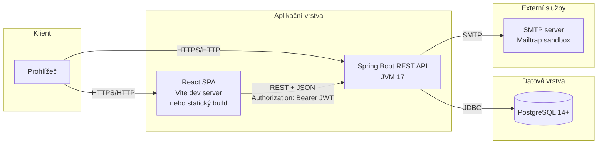

### 1.1 Hlavní rozhodnutí

| Rozhodnutí                | Důvod                                                                                                                |
| ------------------------- | -------------------------------------------------------------------------------------------------------------------- |
| Stateless JWT             | Server nedrží session úložiště. Snadné horizontální škálování, snadná dockerizace.                                   |
| PostgreSQL přes Flyway    | Schéma je verzované, deterministické, volatelné. V testech H2 in-memory, abychom nepotřebovali Postgres.             |
| Spring Boot 3.2           | Standardní volba pro Java backend; Jakarta EE 9+ namespace, Spring Security 6, Hibernate 6.                          |
| React 18 + TypeScript     | Komponentový SPA frontend s typovou bezpečností. Vite jako rychlý dev server / bundler.                              |
| OpenAPI 3 (springdoc)     | Generování dokumentace přímo z anotovaného kódu. Swagger UI s JWT bearer pro pohodlné volání endpointů.              |
| Mail starter + log-only   | Produkce posílá přes `JavaMailSender` (`app.mail.log-only=false` jako produkční default). Profil `dev` přepíná na log-only fallback, kdy se obsah e-mailu vypíše do konzole místo otevření SMTP konektivity — pohodlné pro lokální vývoj bez SMTP. **V produkci log-only NESMÍ být zapnutý**, jinak by se verifikační a resetovací tokeny dostaly do aplikačních logů. |

---

## 2. Vrstvená architektura backendu

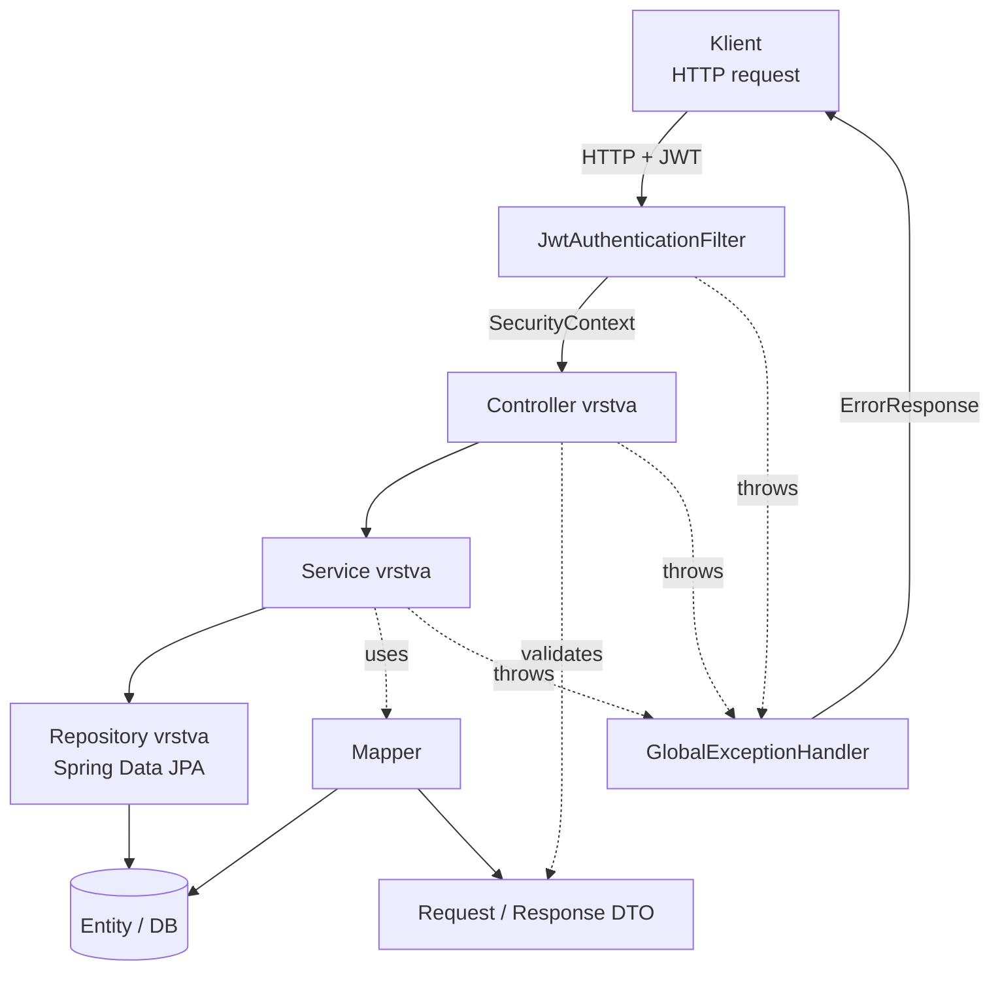

### 2.1 Odpovědnosti vrstev

| Vrstva           | Odpovědnost                                                                                                                              |
| ---------------- | ---------------------------------------------------------------------------------------------------------------------------------------- |
| **Controller**   | HTTP I/O. Validace DTO (`@Valid`), mapování parametrů, OpenAPI anotace. Žádná business logika.                                           |
| **Service**      | Business pravidla, transakcionalita (`@Transactional`), volání více repository, vyhazování doménových výjimek.                           |
| **Repository**   | Přístup k DB přes Spring Data JPA. Definuje `findBy*`, vlastní JPQL dotazy.                                                              |
| **Entity**       | JPA mapování na DB tabulky. Bezstavové reprezentace dat. Žádná business logika navíc.                                                    |
| **DTO**          | Samostatné typy pro vstup / výstup. Brání úniku interních polí ven (např. `password`).                                                   |
| **Mapper**       | Konverze Entity ↔ DTO. Stateless `@Component`.                                                                                           |
| **Validation**   | Vlastní cross-field validátory (`@ValidRideRequest`) přes Bean Validation API.                                                           |
| **Security**     | JWT filter, token provider, UserDetailsService.                                                                                          |
| **Config**       | Beans pro Security, CORS, OpenAPI.                                                                                                       |
| **Exception**    | Typované výjimky + globální handler, který je mapuje na konzistentní `ErrorResponse`.                                                    |

### 2.2 Adresářová struktura

```
backend/src/main/java/cz/bezcisobe/backend/
├── BackendApplication.java         # Spring Boot entry point
├── config/
│   ├── SecurityConfig.java         # Filter chain, role autorizace
│   ├── CorsConfig.java             # CORS pravidla pro frontend
│   └── OpenApiConfig.java          # Swagger / OpenAPI s JWT bearer
├── controller/
│   ├── AuthController.java         # /api/auth/*
│   ├── RaceController.java         # /api/races/*
│   ├── RideController.java         # /api/rides/*
│   ├── ReferenceController.java    # /api/reference/*
│   └── AdminController.java        # /api/admin/*  (ROLE_ADMIN)
├── dto/
│   ├── request/                    # LoginRequest, RegisterRequest,
│   │                               # CreateRideRequest, UpdateRideRequest,
│   │                               # ForgotPasswordRequest, ResetPasswordRequest,
│   │                               # ResendVerificationRequest
│   ├── response/                   # AuthResponse, UserResponse,
│   │                               # RaceResponse, RideResponse,
│   │                               # ErrorResponse, PageResponse
│   └── mapper/                     # UserMapper, RaceMapper, RideMapper
├── entity/
│   ├── User.java
│   ├── Role.java                   # Enum: ROLE_USER, ROLE_ADMIN
│   ├── Race.java
│   ├── Ride.java
│   ├── RaceCalendar.java
│   ├── TrackLength.java
│   ├── TrackType.java
│   ├── Certification.java
│   ├── VerificationToken.java
│   └── PasswordResetToken.java
├── exception/
│   ├── BadRequestException.java
│   ├── DuplicateResourceException.java
│   ├── ResourceNotFoundException.java
│   └── GlobalExceptionHandler.java
├── repository/                     # JPA repository interfaces
├── security/
│   ├── JwtAuthenticationFilter.java
│   ├── JwtAuthenticationEntryPoint.java
│   ├── JwtTokenProvider.java
│   ├── UserDetailsImpl.java
│   └── UserDetailsServiceImpl.java
├── service/
│   ├── AuthService.java
│   ├── RaceService.java
│   ├── RideService.java
│   ├── AdminService.java
│   ├── ReferenceDataService.java
│   └── EmailService.java
└── validation/
    ├── ValidRideRequest.java
    └── ValidRideRequestValidator.java
```

---

## 3. Datový model

### 3.1 ER diagram

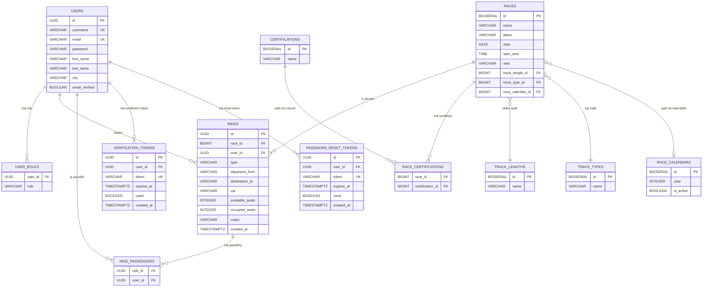

### 3.2 Klíčová pravidla a invarianty

| Tabulka       | Pravidlo                                                                                            |
| ------------- | --------------------------------------------------------------------------------------------------- |
| `users`       | `username` a `email` jsou UNIQUE. `email_verified` defaultně `false`.                               |
| `rides`       | `type` je CHECK constraint na hodnoty `'OFFER'` nebo `'REQUEST'`.                                   |
| `rides`       | `chk_seats`: `occupied_seats <= available_seats`.                                                   |
| `user_roles`  | Kompozitní PK `(user_id, role)`. Smaže se `ON DELETE CASCADE` při smazání uživatele.                |
| `*_tokens`    | `token` je UNIQUE. `used` defaultně `false`. Expirace se kontroluje aplikačně přes `expires_at`.    |

### 3.3 Indexy

- `idx_races_date` na `races(date)` – pro vyhledávání podle data.
- `idx_rides_race_id` na `rides(race_id)` – pro výpis jízd k závodu.
- `idx_rides_user_id` na `rides(user_id)` – pro výpis "moje jízdy".
- `idx_verification_tokens_user_id`, `idx_password_reset_tokens_user_id`
  – pro úklid tokenů při znovuzaslání.
- Unikátní index na `verification_tokens.token` a
  `password_reset_tokens.token` (z UNIQUE constraint).

### 3.4 Flyway migrace

| Migrace                                          | Účel                                                                                        |
| ------------------------------------------------ | ------------------------------------------------------------------------------------------- |
| V1 `create_schema.sql`                           | Tabulky users, races, rides + reference tabulky a vazební tabulky.                          |
| V2 `seed_reference_data.sql`                     | Číselníky délek / typů tratí / certifikací / race_calendars.                                |
| V3 `seed_users_and_races.sql`                    | Základní seed: admin, jana.novakova, ivka + ukázkové závody.                                |
| V4 `seed_rides.sql`                              | Ukázkové jízdy.                                                                             |
| V5 `seed_more_races_users_rides.sql`             | 800+ závodů scrapnutých z ceskybeh.cz/terminovka, 8 dalších uživatelů.                      |
| V6 `seed_2027_races_and_remaining_rides.sql`     | Doplnění závodů na rok 2027.                                                                |
| V7 `fix_ride_destinations.sql`                   | Oprava chyby v destinacích.                                                                 |
| V8 `remove_admin_from_rides.sql`                 | Vyčištění – admin nevystupuje v sample datech jako spolujezdec.                             |
| V9 `seed_international_users_and_rides.sql`      | 10 mezinárodních uživatelů s vlastními jízdami.                                             |
| V10 `email_verification_and_reset.sql`           | Sloupec `email_verified` + tabulky `verification_tokens` a `password_reset_tokens`.         |

---

## 4. Komponentový design

### 4.1 Klíčové komponenty backendu

| Komponenta              | Typ            | Odpovědnost                                                                              |
| ----------------------- | -------------- | ---------------------------------------------------------------------------------------- |
| `AuthService`           | Service        | Registrace, přihlášení, e-mail verifikace, reset hesla. Centralizovaná autentizační logika. |
| `EmailService`          | Service        | Wrapper nad `JavaMailSender`. Skládá HTML/text těla, sestavuje URL z `APP_URL`.          |
| `RideService`           | Service        | CRUD jízd, accept/cancel, validace vlastnictví.                                          |
| `RaceService`           | Service        | Listing + paginované hledání závodů.                                                     |
| `AdminService`          | Service        | Administrátorské operace nad uživateli a jízdami.                                        |
| `JwtTokenProvider`      | Security       | Generování a parsing JWT, validace podpisu a expirace.                                   |
| `JwtAuthenticationFilter` | Filter        | Pro každý request načte JWT z hlavičky a vyplní SecurityContext.                          |
| `UserDetailsImpl`       | Security       | Spring Security `UserDetails`. `isEnabled()` vrací `emailVerified`.                       |
| `GlobalExceptionHandler` | Cross-cutting | Mapuje doménové výjimky na `ErrorResponse` a HTTP kódy.                                  |
| `ValidRideRequestValidator` | Validation | Cross-field constraint, vynucuje pravidla mezi `type`, `car`, `availableSeats`.          |

### 4.2 Závislosti mezi vrstvami

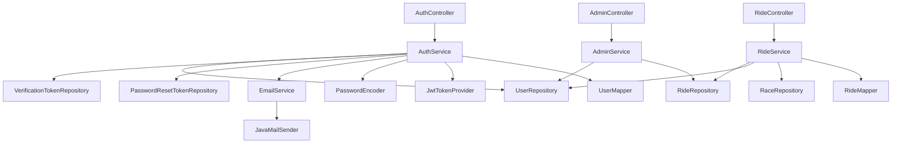

---

## 5. Bezpečnostní design

### 5.1 Vrstvy obrany

| Vrstva                         | Co kontroluje                                                          |
| ------------------------------ | ---------------------------------------------------------------------- |
| 1. **CORS filter**             | Povolené origins z `CorsConfig` (jen frontend hostname).               |
| 2. **JWT filter**              | Validuje JWT, naplní `SecurityContext` (anonymous, ROLE_USER, ROLE_ADMIN). |
| 3. **URL filter**              | `SecurityConfig` definuje request matchery – kdo smí kam.               |
| 4. **Method security**         | `@PreAuthorize` na úrovni service / controller metody.                  |
| 5. **Validation**              | Bean Validation + `@ValidRideRequest` na DTO.                          |
| 6. **GlobalExceptionHandler**  | Konzistentní `ErrorResponse`, žádný únik stack tracu.                  |

### 5.2 JWT pipeline

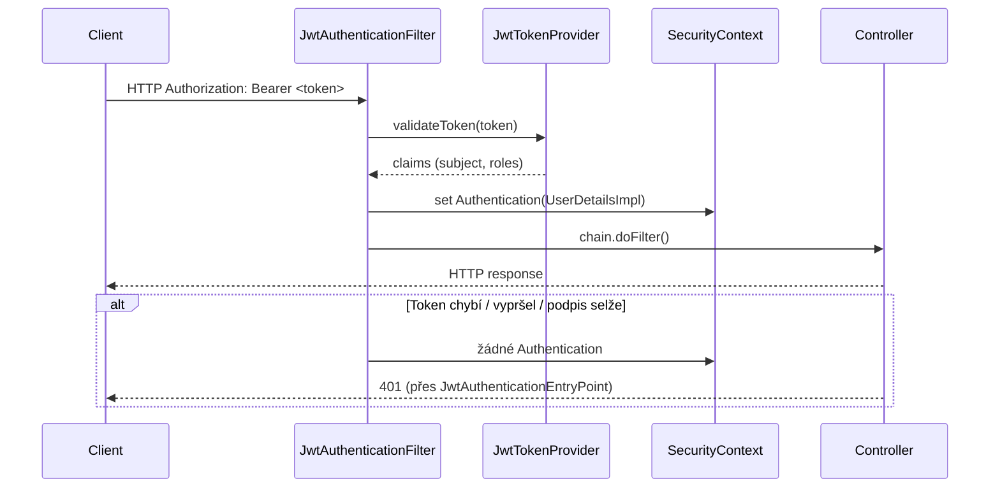

### 5.3 Hashování hesel

- `BCryptPasswordEncoder` s defaultním cost 10.
- Hesla seedovaných uživatelů jsou v V3 migraci jako pre-computed
  BCrypt hashe.
- `BCryptHashValidationTest` ověřuje, že seedovaný hash skutečně
  odpovídá heslu dokumentovanému v README – pokud se hesla rozjedou,
  test selže.

### 5.4 Tajné údaje

| Tajemství         | Zdroj                                                                                                                              |
| ----------------- | ---------------------------------------------------------------------------------------------------------------------------------- |
| JWT secret        | env `JWT_SECRET`. YAML obsahuje dev placeholder, který produkce NESMÍ použít.                                                       |
| DB credentials    | env `DATABASE_URL`, `DATABASE_USERNAME`, `DATABASE_PASSWORD`.                                                                       |
| SMTP credentials  | env `MAIL_USERNAME`, `MAIL_PASSWORD`. Bez nich profil `dev` přepne na log-only režim.                                              |

### 5.5 Ochrana proti enumeraci účtů

Endpointy `POST /forgot-password` a `POST /resend-verification` vrací
vždy HTTP 204 bez ohledu na to, jestli e-mail v systému existuje.
Útočník tak nemůže měřit response a zjistit, kdo má účet.

### 5.6 Ochrana proti brute-force přihlášení

V aktuální verzi není implementován rate limiting – je to známé
omezení uvedené v "Missing features" v
[TECHNICAL_DOCUMENTATION.md](TECHNICAL_DOCUMENTATION.md). V produkci
by se přidal Spring Security `RateLimiter` filter nebo proxy-level
limit.

---

## 6. Sekvenční diagramy klíčových scénářů

### 6.1 Registrace s ověřením e-mailu

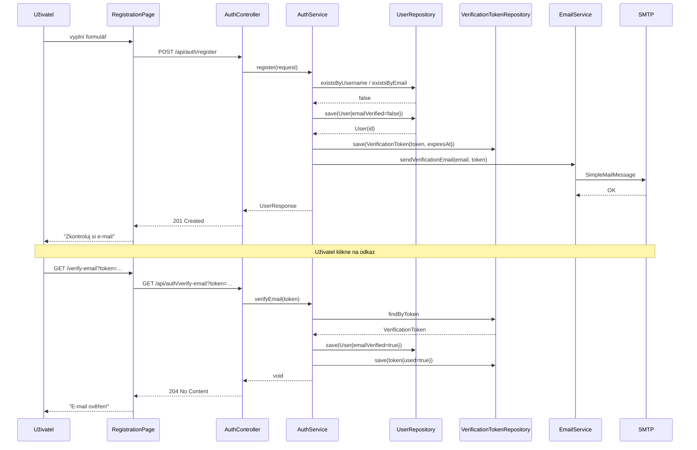

### 6.2 Reset zapomenutého hesla

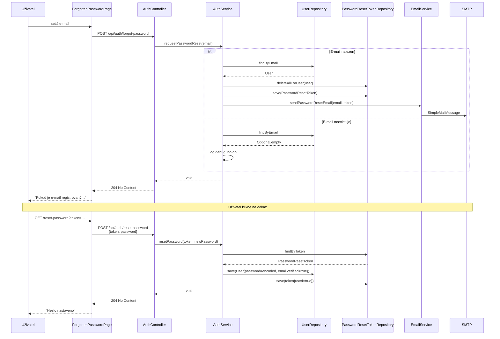

### 6.3 Vytvoření jízdy s validací

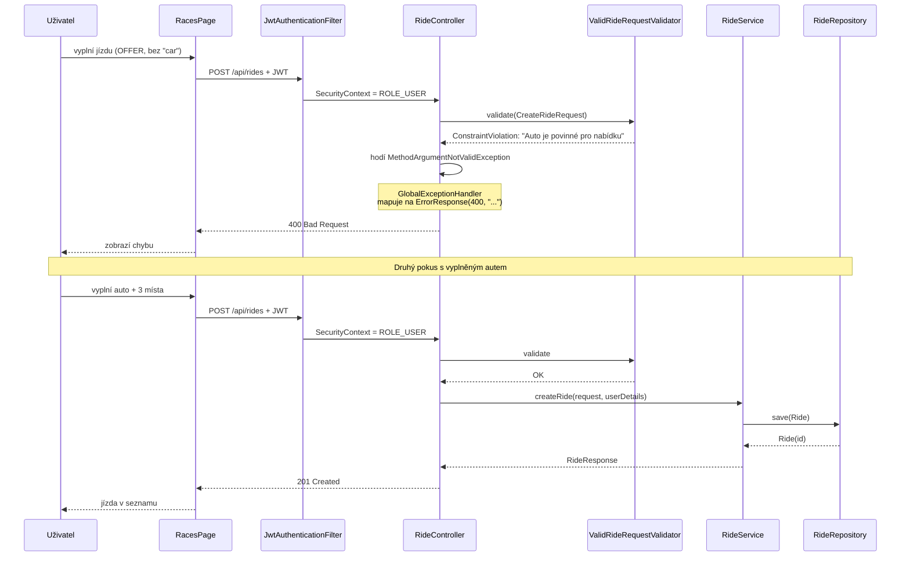

### 6.4 Pokus o přihlášení neověřeného účtu

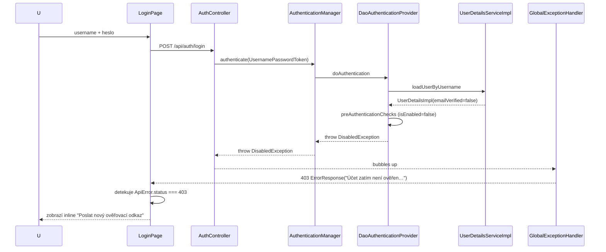

---

## 7. Frontend design

### 7.1 Komponentní struktura

```
src/
├── App.tsx                    # BrowserRouter + AuthProvider
├── routes/
│   └── AppRouter.tsx          # Route definice
├── components/
│   ├── layout/                # Header, Footer, Layout
│   └── ui/                    # Tlačítka, karty, formulářové prvky
├── pages/
│   ├── HomePage.tsx
│   ├── AboutPage.tsx
│   ├── RacesPage.tsx
│   ├── OrganizersPage.tsx
│   ├── LoginPage.tsx
│   ├── RegistrationPage.tsx
│   ├── ForgottenPasswordPage.tsx
│   ├── VerifyEmailPage.tsx
│   ├── ResetPasswordPage.tsx
│   ├── ProfilePage.tsx
│   └── TermsPage.tsx
├── contexts/
│   ├── AuthContext.tsx        # Globální stav přihlášeného uživatele
│   ├── ThemeContext.tsx       # Light/Dark mode
│   └── LanguageContext.tsx    # i18n
├── i18n/
│   └── translations.ts        # Slovník cs + en
├── services/
│   └── apiService.ts          # Tenký fetch wrapper, ApiError class
├── types/                     # TS typy sdílené napříč aplikací
└── utils/
    └── validation.ts          # Klientské validátory
```

### 7.2 Routing

Aplikace používá React Router 6. Všechny routy jsou definovány v
`AppRouter.tsx`. Chráněné stránky (`/profile`) nemají dedikovaný
guard – frontend se spolehne na to, že backend vrátí 401 a
`AuthContext` při tom uživatele přesměruje. (Pro reálnou produkci
by se přidal `RequireAuth` wrapper.)

### 7.3 Stav

- **Globální stav přihlášení:** `AuthContext` – drží `user`,
  `isAuthenticated`, metody `login` / `register` / `logout`.
- **Stav stránek:** `useState` v rámci konkrétní `*Page.tsx`.
- **JWT token:** `localStorage` pod klíčem `bezci_sobe_token`.
- **Locale:** `localStorage` pod klíčem `bezci_locale`.
- **Theme:** `localStorage` pod klíčem `bezci_theme`.

### 7.4 API komunikace

`apiService.ts` je tenký wrapper nad `fetch`. Tři klíčová rozhodnutí:

1. **Token se přikládá automaticky** do hlavičky `Authorization` u všech
   metod, které volají `authHeaders()`.
2. **Chyby se vyhazují jako typovaný `ApiError`** s polem `status`,
   takže UI vrstva může rozlišit 401 / 403 / 409 bez parsování textu
   zprávy.
3. **Verify / forgot / reset endpointy** neprozradí, jestli e-mail
   existuje – z UX pohledu vždy ukazujeme stejné potvrzení.

---

## 8. Strategie nasazení

### 8.1 Dev prostředí

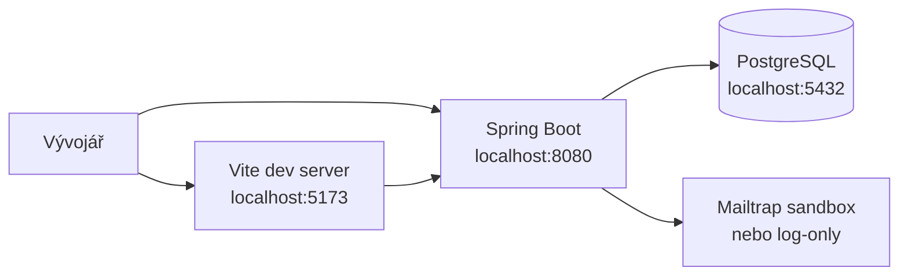

### 8.2 Produkční prostředí (referenční)

Aplikace je navržená tak, aby šla nasadit jako klasický 3-tier:

| Komponenta | Doporučené nasazení                                                           |
| ---------- | ----------------------------------------------------------------------------- |
| Frontend   | Statický build (`npm run build`) na nginx / CDN / Vercel.                     |
| Backend    | Spring Boot fat-jar v Dockeru za reverzní proxy.                              |
| Databáze   | Managed PostgreSQL (AWS RDS, Azure Database, …).                              |
| SMTP       | Sendgrid / Mailgun / Mailtrap production.                                     |

### 8.3 Konfigurace přes env proměnné

| Proměnná                                              | Výchozí                                  | Účel                                                            |
| ----------------------------------------------------- | ---------------------------------------- | --------------------------------------------------------------- |
| `DATABASE_URL`                                        | `jdbc:postgresql://localhost:5432/bezcisobe` | JDBC URL                                                        |
| `DATABASE_USERNAME` / `DATABASE_PASSWORD`             | `postgres` / `postgres`                  | DB přístup                                                      |
| `JWT_SECRET`                                          | dev placeholder                          | HMAC-SHA256 podpisový klíč                                       |
| `JWT_EXPIRATION_MS`                                   | `86400000` (24 h)                        | Platnost JWT                                                    |
| `MAIL_HOST` / `MAIL_PORT`                             | `sandbox.smtp.mailtrap.io` / `2525`      | SMTP                                                            |
| `MAIL_USERNAME` / `MAIL_PASSWORD`                     | prázdné                                  | SMTP credentials                                                |
| `MAIL_FROM`                                           | `no-reply@bezcisobe.local`               | From: adresa odchozích e-mailů                                  |
| `MAIL_LOG_ONLY`                                       | `false` (prod) / `true` (dev profil)     | `true` → e-mail se jen vypíše do logu, neposílá se přes SMTP    |
| `APP_URL`                                             | `http://localhost:5173`                  | Základ URL v odkazech verifikace / resetu                       |

---

## 9. Strategie chyb a logování

### 9.1 Mapování výjimek → HTTP

| Výjimka                          | HTTP kód                  | Příklad                                                        |
| -------------------------------- | ------------------------- | -------------------------------------------------------------- |
| `ResourceNotFoundException`      | 404 Not Found             | Závod / jízda / uživatel neexistuje.                           |
| `BadRequestException`            | 400 Bad Request           | Token neplatný / vypršel.                                      |
| `MethodArgumentNotValidException`| 400 Bad Request           | Bean Validation selhala.                                       |
| `DuplicateResourceException`     | 409 Conflict              | Username / e-mail už existuje.                                 |
| `BadCredentialsException`        | 401 Unauthorized          | Špatné heslo.                                                  |
| `DisabledException`              | 403 Forbidden             | Účet existuje, ale není ověřený e-mail.                        |
| `AccessDeniedException`          | 403 Forbidden             | Volající nemá ROLE_ADMIN.                                      |
| `Exception` (catch-all)          | 500 Internal Server Error | Logováno na ERROR, klient dostane jen "Interní chyba serveru". |

Všechny odpovědi mají formát:

```json
{
  "status": 400,
  "message": "Heslo musí mít alespoň 6 znaků"
}
```

### 9.2 Úrovně logování

| Level   | Co se loguje                                                            |
| ------- | ----------------------------------------------------------------------- |
| `DEBUG` | Diagnostika (např. detail JWT validace, no-op v anti-enumeration toku). |
| `INFO`  | Business eventy – login, registrace, vytvoření jízdy, ověření e-mailu.  |
| `WARN`  | Klientské chyby – validace, duplicita, 4xx.                              |
| `ERROR` | Neočekávané pády – catch-all v `GlobalExceptionHandler`.                |

Pattern v `application.yml`:

```
%d{yyyy-MM-dd HH:mm:ss.SSS} %-5level [%thread] %logger{36} - %msg%n
```

### 9.3 Monitoring

- `GET /actuator/health` – pro health-check (liveness/readiness probe).
- `GET /actuator/info` – build & verze.
- Detaily `health` jsou viditelné jen autentizovaným volajícím
  (`management.endpoint.health.show-details=when_authorized`).

---

## 10. Strategie testování

### 10.1 Pyramida testů

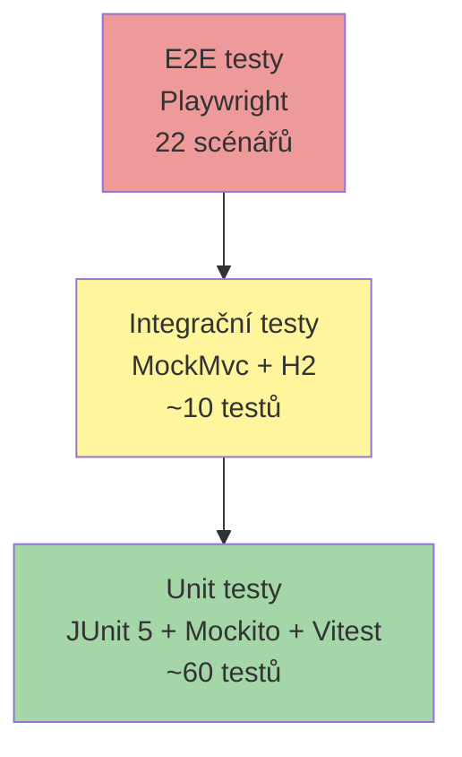

### 10.2 Pokrytí

| Vrstva      | Jak se testuje                                                                                 |
| ----------- | ---------------------------------------------------------------------------------------------- |
| Controller  | `@SpringBootTest` + `MockMvc`, `@MockBean` pro service vrstvu. Ověřuje HTTP I/O a validaci.    |
| Service     | `@ExtendWith(MockitoExtension.class)`, mockované repository. Ověřuje business logiku.          |
| Repository  | Nepřímo přes integrační testy (H2 in-memory + `ddl-auto=create-drop`).                          |
| Validator   | Přímý `Validator.validate` v JUnit testu pro každé pravidlo `@ValidRideRequest`.               |
| Frontend    | Vitest + React Testing Library pro komponenty, `vi.stubGlobal('fetch', …)` pro API.            |
| E2E         | Playwright proti reálnému dev serveru.                                                         |

### 10.3 Smluvní testy bezpečnosti

`BCryptHashValidationTest` ověřuje, že seedovaná hesla v V3 migraci
opravdu odpovídají hashům – pokud se hesla rozjedou s tím, co je
napsané v README, test selže a build neprojde.

---

## 11. Návrhové vzory a principy

### 11.1 Použité návrhové vzory

| Vzor                         | Aplikace                                                                              |
| ---------------------------- | ------------------------------------------------------------------------------------- |
| **Layered architecture**     | Controller → Service → Repository → Entity                                            |
| **Repository pattern**       | Spring Data JPA – interface místo SQL stringu, automatická implementace.              |
| **DTO pattern**              | Oddělení Entity (DB) od kontraktu API.                                                 |
| **Mapper**                   | Stateless komponenty `*Mapper.toResponse()` / `toEntity()`.                            |
| **Dependency injection**     | Konstruktorová injekce přes Lombok `@RequiredArgsConstructor`.                        |
| **Filter chain**             | Spring Security – řetěz filtrů (CORS → JWT → Authorization → …).                       |
| **Builder pattern**          | Lombok `@Builder` u entit a tokenů pro čistou konstrukci.                              |
| **Custom validator**         | `ValidRideRequestValidator` implementuje `ConstraintValidator`.                       |
| **Strategy (log vs SMTP)**   | `EmailService.send()` přepíná mezi log-only a `JavaMailSender` podle `app.mail.log-only`. |
| **Context API**              | Frontend – `AuthContext`, `ThemeContext`, `LanguageContext`.                          |

### 11.2 Principy

- **SOLID** – každá třída má jednu odpovědnost (např. `EmailService`
  jen posílá maily; `AuthService` neví, jak se mail skládá).
- **Defence in depth** – method security + URL filter (viz §5.1).
- **Fail closed** – výchozí pravidlo bezpečnosti je `anyRequest().authenticated()`,
  veřejné endpointy jsou explicitně vyjmenované.
- **Least privilege** – role-based přístup, admin nikdy nedostane
  data přes user endpoint, user nikdy nedostane admin endpoint.
- **No secrets in code** – tajemství výhradně z env proměnných.
- **Convention over configuration** – Spring Boot starters automaticky
  nakonfigurují JPA, Security, MailSender.
- **Schema as code** – Flyway migrace versionované v gitu, žádné
  ručně psané ALTER TABLE v produkci.
