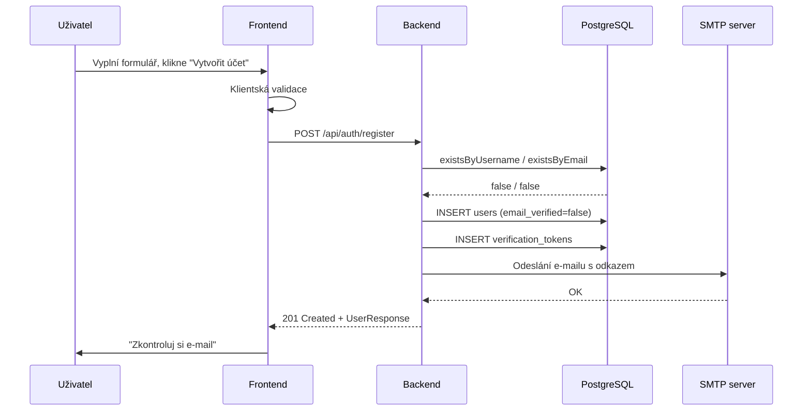

# Specifikace softwarových požadavků (SRS)

**Projekt:** Běžci sobě – platforma pro sdílení dopravy mezi běžci
**Verze dokumentu:** 1.0
**Datum:** 2026-05-28
**Autor:** Iva Fischerová

---

## Obsah

1. [Úvod](#1-úvod)
2. [Celkový popis](#2-celkový-popis)
3. [Funkční požadavky](#3-funkční-požadavky)
4. [Nefunkční požadavky](#4-nefunkční-požadavky)
5. [Případy užití (use cases)](#5-případy-užití-use-cases)
6. [Externí rozhraní](#6-externí-rozhraní)
7. [Omezení](#7-omezení)
8. [Slovník pojmů](#8-slovník-pojmů)

---

## 1. Úvod

### 1.1 Účel dokumentu

Tento dokument popisuje funkční a nefunkční požadavky kladené na webovou
aplikaci **Běžci sobě**. Slouží jako podklad pro návrh systému (viz
[SDD.md](SDD.md)), jako referenční bod při implementaci a jako zdroj
pro akceptační testování.

### 1.2 Rozsah projektu

Běžci sobě je webová full-stack aplikace, která propojuje běžce
cestující na české běžecké závody. Uživatel může:

- nabídnout svoji jízdu (jako řidič) – kolik míst v autě má volných,
- nebo o ni požádat (jako spolujezdec).

Aplikace umožňuje vyhledávat závody, zakládat a přijímat jízdy,
udržovat uživatelský profil a řízeně spravovat data administrátorem.

Není cílem aplikace:

- zprostředkovávat platby mezi uživateli,
- řídit logistiku samotné cesty (sledování polohy, real-time chat),
- nahrazovat oficiální registraci na závod.

### 1.3 Cílová skupina dokumentu

- **Studenti a vyučující** – jako součást ročníkového projektu.
- **Vývojářský tým** – jako vstup pro návrh a implementaci.
- **Akceptační testeři** – jako reference pro ověření hotových
  funkčních požadavků.

### 1.4 Reference

- Spring Boot 3.2 referenční dokumentace
- OWASP Top 10 (2021) – zohledněné při bezpečnostním návrhu
- JWT (RFC 7519)
- BCrypt – Provos & Mazières, 1999
- OpenAPI Specification 3.0

---

## 2. Celkový popis

### 2.1 Perspektiva produktu

Běžci sobě je **samostatná aplikace** (greenfield), nezávisí na žádném
existujícím IS. Skládá se ze tří hlavních komponent:

- **Frontend** – jednostránková aplikace v Reactu.
- **Backend** – REST API ve Spring Bootu, běží na JVM.
- **Databáze** – PostgreSQL pro produkční nasazení, H2 in-memory pro
  testy.

Komunikace mezi frontendem a backendem probíhá výhradně přes HTTPS /
HTTP (REST + JSON). Autentizace je řešena stateless JWT tokenem
v hlavičce `Authorization: Bearer <token>`.

### 2.2 Hlavní funkce produktu

| Kód | Funkce                                                    |
| --- | --------------------------------------------------------- |
| F1  | Registrace nového uživatele s povinným ověřením e-mailu   |
| F2  | Přihlášení a odhlášení (JWT)                              |
| F3  | Reset zapomenutého hesla přes e-mailový token             |
| F4  | Procházení katalogu závodů s vyhledáváním a paginací      |
| F5  | Zobrazení detailu závodu                                  |
| F6  | Vytvoření nabídky jízdy (OFFER) nebo poptávky (REQUEST)   |
| F7  | Úprava a smazání vlastní jízdy                            |
| F8  | Přijetí cizí nabídky jízdy (rezervace místa)              |
| F9  | Zrušení vlastního přijetí nabídky                         |
| F10 | Zobrazení profilu uživatele                               |
| F11 | Administrace uživatelů (výpis, hledání) – jen admin       |
| F12 | Force-delete jakékoli jízdy administrátorem               |
| F13 | Přepínání jazyka UI (čeština ↔ angličtina)                |
| F14 | Přepínání motivu (světlý ↔ tmavý)                         |

### 2.3 Charakteristika uživatelů

| Role          | Popis                                                                            |
| ------------- | -------------------------------------------------------------------------------- |
| Anonym        | Návštěvník bez účtu. Smí jen procházet závody a jízdy v read-only režimu.        |
| Běžný uživatel | Registrovaný a ověřený účet. Smí zakládat a přijímat jízdy, spravovat profil.   |
| Administrátor | Privilegovaný účet. Smí všechno, co běžný uživatel, navíc administrace systému. |

### 2.4 Provozní prostředí

- **Server:** Linux nebo Windows s JDK 17+ a PostgreSQL 14+.
- **Klient:** Chrome 110+, Firefox 110+, Edge 110+, Safari 16+.
- **Síť:** HTTPS pro produkci, HTTP pro lokální vývoj.
- **SMTP:** přístup k SMTP serveru (např. Mailtrap sandbox) pro
  odesílání verifikačních a resetových e-mailů.

---

## 3. Funkční požadavky

Konvence: **FRn** = funkční požadavek, **Pn** = priorita
(P1 = must have, P2 = should have, P3 = nice to have).

### 3.1 Autentizace a správa účtu

| ID    | P  | Požadavek                                                                                                                                                              |
| ----- | -- | ---------------------------------------------------------------------------------------------------------------------------------------------------------------------- |
| FR1   | P1 | Systém umožní anonymnímu návštěvníkovi založit účet zadáním unikátního uživatelského jména, e-mailu a hesla.                                                            |
| FR2   | P1 | Po registraci systém vygeneruje verifikační token s platností 24 hodin a pošle ho uživateli e-mailem.                                                                  |
| FR3   | P1 | Účet je neaktivní (`email_verified = false`), dokud uživatel neklikne na verifikační odkaz.                                                                            |
| FR4   | P1 | Pokus o přihlášení neověřeným účtem vrátí HTTP 403 s vysvětlující hláškou.                                                                                              |
| FR5   | P2 | Uživatel si může vyžádat nový verifikační odkaz (pokud původní vypršel nebo se ztratil).                                                                               |
| FR6   | P1 | Uživatel se přihlásí kombinací uživatelské jméno + heslo a obdrží JWT s platností 24 hodin.                                                                            |
| FR7   | P1 | Uživatel se může odhlásit – frontend smaže JWT z `localStorage`, backend není potřeba volat (stateless).                                                                |
| FR8   | P1 | Uživatel může požádat o reset hesla zadáním e-mailové adresy.                                                                                                          |
| FR9   | P1 | Při reset-požadavku systém pošle e-mailem reset token s platností 1 hodina (pouze pokud e-mail patří existujícímu účtu, ale toto rozhodnutí klientovi neprozradí).      |
| FR10  | P1 | Uživatel může pomocí reset tokenu nastavit nové heslo. Úspěšný reset zároveň označí účet jako ověřený.                                                                  |
| FR11  | P1 | Uživatel může zobrazit svůj profil (jméno, e-mail, město, role).                                                                                                       |

### 3.2 Závody

| ID    | P  | Požadavek                                                                                                                                                              |
| ----- | -- | ---------------------------------------------------------------------------------------------------------------------------------------------------------------------- |
| FR12  | P1 | Systém zobrazí seznam všech závodů anonymnímu i přihlášenému uživateli.                                                                                                |
| FR13  | P1 | Uživatel může vyhledávat závody podle názvu, místa a data, kombinovat filtry.                                                                                          |
| FR14  | P1 | Výsledky jsou stránkované (default 20 záznamů na stránku).                                                                                                             |
| FR15  | P2 | Systém zobrazí detail závodu (datum, čas, místo, délka tratě, typ tratě, certifikace, odkaz na web).                                                                   |

### 3.3 Jízdy (OFFER a REQUEST)

| ID    | P  | Požadavek                                                                                                                                                              |
| ----- | -- | ---------------------------------------------------------------------------------------------------------------------------------------------------------------------- |
| FR17  | P1 | Přihlášený uživatel může vytvořit jízdu typu OFFER (řidič) nebo REQUEST (spolujezdec) pro vybraný závod.                                                               |
| FR18  | P1 | OFFER musí mít vyplněné auto (`car`) a počet míst (`availableSeats >= 1`). REQUEST naopak `car` nesmí mít.                                                              |
| FR19  | P1 | Uživatel může upravit nebo smazat jen svoji jízdu.                                                                                                                     |
| FR20  | P1 | Jiný uživatel může OFFER jízdu přijmout, pokud má volné místo. Tím se mu zvýší `occupied_seats` a uloží se vazba `ride_passengers`.                                    |
| FR21  | P1 | Přijatý uživatel může své přijetí zrušit. Tím se `occupied_seats` sníží.                                                                                                |
| FR22  | P2 | Anonym může jízdy procházet, nikoli zakládat / přijímat.                                                                                                               |
| FR23  | P1 | Jízda se zobrazí v seznamu jízd daného závodu (`GET /api/rides?raceId=…`).                                                                                             |
| FR24  | P1 | Pokud je `race.date` v minulosti, systém odmítne vytvoření nové jízdy i přijetí cizí OFFER nabídky pro daný závod (HTTP 400). Úpravy a mazání vlastní jízdy ani zrušení vlastního přijetí blokované nejsou. |
| FR25  | P2 | UI v detailu proběhlého závodu zobrazí označení **PROBĚHLO** / **FINISHED**, skryje tlačítko *Přidat jízdu* a u stávajících nabídek zneaktivní tlačítko *Přijmout*. |

### 3.4 Administrace

| ID    | P  | Požadavek                                                                                                                                                              |
| ----- | -- | ---------------------------------------------------------------------------------------------------------------------------------------------------------------------- |
| FR26  | P1 | Administrátor smí získat stránkovaný seznam všech uživatelů.                                                                                                           |
| FR27  | P2 | Administrátor smí v seznamu uživatelů vyhledávat (case-insensitive napříč username / email / firstName / lastName).                                                    |
| FR28  | P1 | Administrátor smí smazat libovolnou jízdu, i pokud není jejím vlastníkem (force-delete).                                                                               |
| FR29  | P1 | Endpointy `/api/admin/**` jsou dostupné pouze pro `ROLE_ADMIN`. Jakýkoli jiný přístup vrátí 401 (neautentizovaný) nebo 403 (autentizovaný, ale bez práva).             |

### 3.5 UI funkce

| ID    | P  | Požadavek                                                                                                                                                              |
| ----- | -- | ---------------------------------------------------------------------------------------------------------------------------------------------------------------------- |
| FR30  | P3 | UI je dvojjazyčné (čeština + angličtina), volba se persistuje v `localStorage`.                                                                                        |
| FR31  | P3 | UI má světlý a tmavý motiv, volba se persistuje v `localStorage` a při první návštěvě respektuje OS `prefers-color-scheme`.                                            |
| FR32  | P3 | UI je responzivní (mobil, tablet, desktop).                                                                                                                            |

---

## 4. Nefunkční požadavky

### 4.1 Bezpečnost

| ID    | Požadavek                                                                                                                                                  |
| ----- | ---------------------------------------------------------------------------------------------------------------------------------------------------------- |
| NFR1  | Hesla se nikdy nesmí ukládat v plain textu. Používá se BCrypt s cost faktorem 10.                                                                          |
| NFR2  | Autentizační JWT secret se čte z env proměnné `JWT_SECRET`; YAML obsahuje pouze dev placeholder, který se v produkci NESMÍ použít.                          |
| NFR3  | Endpointy citlivé na roli musí být chráněné dvěma vrstvami: URL filtrem (`SecurityConfig`) a anotací `@PreAuthorize` (defence in depth).                    |
| NFR4  | API odpovědi pro `/forgot-password` a `/resend-verification` jsou identické bez ohledu na existenci e-mailu (prevence enumerace účtů).                     |
| NFR5  | Stack trace nikdy nesmí prosáknout do odpovědi klienta; všechny výjimky se transformují v `GlobalExceptionHandler` na obecný `ErrorResponse`.              |
| NFR6  | DB credentials se čtou z env proměnných `DATABASE_URL`, `DATABASE_USERNAME`, `DATABASE_PASSWORD`.                                                          |
| NFR7  | npm závislosti se instalují s vypnutými post-install skripty (`ignore-scripts=true`).                                                                      |

### 4.2 Výkon

| ID    | Požadavek                                                                                                                  |
| ----- | -------------------------------------------------------------------------------------------------------------------------- |
| NFR8  | Doba odezvy 95. percentil pro běžné dotazy (login, výpis závodů, výpis jízd) ≤ 500 ms na referenční stroj (Postgres lokálně). |
| NFR9  | Seznam závodů musí podporovat paginaci, výchozí stránka 20 záznamů.                                                         |
| NFR10 | Tabulka `rides` má indexy `idx_rides_race_id` a `idx_rides_user_id` pro rychlé hledání.                                     |
| NFR11 | Tabulka `races` má index `idx_races_date`.                                                                                  |

### 4.3 Použitelnost

| ID    | Požadavek                                                                                                                              |
| ----- | -------------------------------------------------------------------------------------------------------------------------------------- |
| NFR12 | Všechny formuláře mají klientskou validaci (HTML5 + JS) i serverovou validaci (Bean Validation).                                       |
| NFR13 | Klientská validace má hlášky v jazyce UI (cs/en). Serverové chyby jsou v aktuální verzi jen v češtině; lokalizace serverových chyb přes `Accept-Language` header je na roadmapě. |
| NFR14 | UI je responzivní od šířky 320 px (telefon) po desktop.                                                                                |

### 4.4 Spolehlivost a údržba

| ID    | Požadavek                                                                                                                                              |
| ----- | ------------------------------------------------------------------------------------------------------------------------------------------------------ |
| NFR15 | Schéma DB se řídí Flyway migracemi – žádné ruční změny v produkci.                                                                                      |
| NFR16 | Backend vystavuje `GET /actuator/health` pro liveness/readiness probe.                                                                                  |
| NFR17 | Backend vystavuje `GET /actuator/info` s informacemi o buildu.                                                                                          |
| NFR18 | Logování probíhá přes SLF4J s úrovněmi DEBUG / INFO / WARN / ERROR a strukturovaným patternem (čas, level, vlákno, logger, zpráva).                    |

### 4.5 Testovatelnost

| ID    | Požadavek                                                                                                                                                      |
| ----- | -------------------------------------------------------------------------------------------------------------------------------------------------------------- |
| NFR19 | Backend má alespoň 50 jednotkových / integračních testů.                                                                                                       |
| NFR20 | Testy běží proti H2 in-memory DB, nepotřebují PostgreSQL.                                                                                                      |
| NFR21 | Frontend má alespoň 30 unit testů (Vitest) a 20 E2E scénářů (Playwright).                                                                                      |
| NFR22 | Bezpečnostní hashe seedovaných účtů jsou self-verified – `BCryptHashValidationTest` ověřuje, že seedované hashe odpovídají dokumentovaným heslům.              |

### 4.6 Dokumentace

| ID    | Požadavek                                                                                                                          |
| ----- | ---------------------------------------------------------------------------------------------------------------------------------- |
| NFR23 | API je dokumentováno přes OpenAPI 3 a vystaveno přes Swagger UI na `/swagger-ui.html`.                                              |
| NFR24 | Swagger UI vystavuje JWT bearer schéma, takže lze chráněné endpointy volat přímo z prohlížeče.                                      |
| NFR25 | Klíčové třídy mají JavaDoc komentáře.                                                                                              |

---

## 5. Případy užití (use cases)

### 5.1 UC1 – Registrace nového uživatele

**Aktér:** Anonym
**Cíl:** Vytvořit a aktivovat účet, aby se mohl přihlásit.

**Hlavní scénář:**

1. Uživatel otevře stránku `/registration`.
2. Vyplní uživatelské jméno, e-mail, heslo, potvrzení hesla, zaškrtne souhlas s podmínkami.
3. Klikne "Vytvořit účet".
4. Frontend validuje pole. Pokud něco chybí, zobrazí chybu a scénář končí.
5. Frontend pošle `POST /api/auth/register`.
6. Backend ověří unikátnost username + e-mailu, uloží uživatele s `email_verified=false`, vygeneruje verifikační token, pošle e-mail.
7. Backend vrátí 201 + objekt uživatele.
8. Frontend přepne stránku do stavu "Zkontroluj si e-mail".

**Alternativní scénář – username/e-mail obsazený:**

- Krok 6 selže s `DuplicateResourceException` → backend vrátí 409.
- Frontend zobrazí chybovou hlášku.



### 5.2 UC2 – Ověření e-mailu

**Aktér:** Anonym (s tokenem z e-mailu)
**Cíl:** Aktivovat účet kliknutím na odkaz.

**Hlavní scénář:**

1. Uživatel klikne na odkaz `…/verify-email?token=…` v doručeném e-mailu.
2. Stránka `VerifyEmailPage` načte token z URL a zavolá `GET /api/auth/verify-email`.
3. Backend ověří token (existuje, není použitý, nevypršel).
4. Backend nastaví `email_verified = true` a označí token jako použitý.
5. Backend vrátí 204.
6. Frontend zobrazí "E-mail ověřen!" + odkaz na přihlášení.

**Chybové scénáře:**

- Token neexistuje / vypršel / byl už použit → backend vrátí 400 s konkrétní hláškou.
- Frontend zobrazí chybu a nabídne formulář pro znovuzaslání odkazu.

### 5.3 UC3 – Vytvoření jízdy (OFFER)

**Aktér:** Běžný uživatel (přihlášený)
**Cíl:** Nabídnout místo v autě jiným běžcům.

**Hlavní scénář:**

1. Uživatel otevře detail závodu a klikne "Přidat jízdu".
2. Zvolí typ "Nabídka", vyplní odkud, kam, auto, počet míst (1–4), poznámku.
3. Klikne "Uložit".
4. Frontend pošle `POST /api/rides`.
5. Backend ověří JWT, namapuje DTO na entitu, spustí `@ValidRideRequest` validátor (kontroluje, že OFFER má `car` a `availableSeats >= 1`).
6. Backend uloží jízdu, vrátí 201 + objekt jízdy.
7. Frontend ji přidá do seznamu jízd daného závodu.

**Chybové scénáře:**

- Validace selže (např. OFFER bez `car`) → backend vrátí 400 s polem `message: "Auto je povinné pro nabídku"`.
- Neautentizovaný uživatel → 401.

### 5.4 UC4 – Přihlášení neověřeného účtu

**Aktér:** Běžný uživatel s `email_verified = false`
**Cíl:** Demonstruje, jak systém brání přístupu do neaktivovaného účtu.

**Hlavní scénář:**

1. Uživatel zadá uživatelské jméno a heslo a klikne "Přihlásit".
2. Frontend zavolá `POST /api/auth/login`.
3. `DaoAuthenticationProvider` načte uživatele přes `UserDetailsServiceImpl`.
4. `UserDetailsImpl.isEnabled()` vrátí `false`.
5. Spring Security hodí `DisabledException`.
6. `GlobalExceptionHandler.handleDisabled` mapuje na HTTP 403 s českou hláškou.
7. Frontend rozezná stavový kód 403 přes vlastní `ApiError.status` a vykreslí blok s tlačítkem "Poslat nový ověřovací odkaz".

### 5.5 UC5 – Force-delete jízdy administrátorem

**Aktér:** Administrátor
**Cíl:** Smazat jízdu jiného uživatele (např. nevhodnou poznámku).

**Hlavní scénář:**

1. Admin přijde do Swagger UI, zadá JWT získané přes `/api/auth/login`.
2. Zavolá `DELETE /api/admin/rides/{id}`.
3. `SecurityConfig` ověří, že volajícímu odpovídá `ROLE_ADMIN` – jinak 403.
4. `@PreAuthorize("hasRole('ADMIN')")` na metodě potvrdí druhou kontrolu.
5. `AdminService` jízdu smaže (s kaskádovým smazáním pasažérů).
6. Backend vrátí 204.

---

## 6. Externí rozhraní

### 6.1 Uživatelské rozhraní

Webové UI v Reactu. Stránky:

- `/` – Domovská stránka s úvodem.
- `/about`, `/organizers`, `/terms` – informační stránky.
- `/races` – Katalog závodů a jejich detail s jízdami.
- `/login`, `/registration`, `/forgotten-password` – Autentizace.
- `/verify-email?token=…` – Cílová stránka ověřovacího odkazu.
- `/reset-password?token=…` – Cílová stránka resetovacího odkazu.
- `/profile` – Profil přihlášeného uživatele.

### 6.2 REST API

Plný REST přehled v [README.md → REST surface](README.md). Hlavní rodiny:

- `/api/auth/*` – přihlášení, registrace, verifikace, reset hesla.
- `/api/races/*`, `/api/rides/*` – business endpointy.
- `/api/reference/*` – číselníky.
- `/api/admin/*` – administrace (vyžaduje ROLE_ADMIN).
- `/actuator/*` – health-check a info.
- `/swagger-ui.html`, `/v3/api-docs` – dokumentace.

Všechny chyby mají jednotný formát:

```json
{
  "status": 400,
  "message": "Heslo musí mít alespoň 6 znaků"
}
```

### 6.3 E-mailové rozhraní

Backend posílá tyto typy e-mailů (přes `JavaMailSender`):

- **Ověření e-mailu** – předmět "Běžci sobě – ověřte svou e-mailovou
  adresu", odkaz `${APP_URL}/verify-email?token=…`.
- **Reset hesla** – předmět "Běžci sobě – obnovení hesla", odkaz
  `${APP_URL}/reset-password?token=…`.

V profilu `dev` lze e-maily přepnout na log-only režim
(`app.mail.log-only=true`), kdy se obsah jen vypíše do konzole.

### 6.4 Externí závislosti

| Závislost              | Účel                                                                                   |
| ---------------------- | -------------------------------------------------------------------------------------- |
| PostgreSQL 14+         | Hlavní úložiště dat                                                                    |
| SMTP server (Mailtrap) | Doručování verifikačních a resetových e-mailů                                          |

---

## 7. Omezení

### 7.1 Technická omezení

- Java verze: 17 (LTS). Není zaručena kompatibilita s Javou 8 nebo 11.
- Spring Boot 3.x → vyžaduje Jakarta EE 9+ namespace.
- Frontend cílí jen na moderní prohlížeče (žádná podpora pro IE).

### 7.2 Business omezení

- Aplikace nezprostředkovává platby.
- Aplikace neslouží k oficiální registraci na závod.
- Aplikace nevynucuje, aby řidič opravdu jel – je to jen platforma pro
  domluvu mezi uživateli.

---

## 8. Slovník pojmů

| Pojem                   | Vysvětlení                                                                                                                                  |
| ----------------------- | ------------------------------------------------------------------------------------------------------------------------------------------- |
| **OFFER**               | Typ jízdy, kdy uživatel nabízí místa v autě jako řidič.                                                                                     |
| **REQUEST**             | Typ jízdy, kdy uživatel hledá někoho, kdo ho na závod doveze.                                                                              |
| **JWT**                 | JSON Web Token. Stateless autentizační token podepsaný HMAC-SHA256 secrettem na serveru. Klient ho posílá v hlavičce `Authorization: Bearer`. |
| **BCrypt**              | Algoritmus pro hashování hesel s vestavěným saltem a configurable cost factorem.                                                            |
| **Bean Validation**     | Standard Jakarta EE pro deklarativní validaci přes anotace (`@NotBlank`, `@Email`, `@Size`, …).                                             |
| **Flyway**              | Nástroj pro verzované databázové migrace. Migrace jsou `V<N>__<popis>.sql`.                                                                 |
| **Actuator**            | Spring Boot modul vystavující operační endpointy (`/actuator/health`, `/actuator/info`).                                                    |
| **DTO**                 | Data Transfer Object – samostatný typ pro přenos dat ven z aplikace (nemíchá se s JPA entitou).                                             |
| **CRUD**                | Create / Read / Update / Delete – základní operace nad datovým objektem.                                                                    |
| **Email enumeration**   | Útok, kdy útočník zjišťuje, jestli daný e-mail v systému existuje, podle různých odpovědí endpointu. Naše API tomu brání jednotnou odpovědí. |
| **Defence in depth**    | Princip vrstvených bezpečnostních kontrol – když selže jedna vrstva, druhá ještě chytne útočníka.                                            |
| **Stateless**           | Vlastnost backendu, kdy server nedrží žádnou session – každý request se autentizuje samostatně přes JWT.                                    |
| **ROLE_USER / ROLE_ADMIN** | Spring Security role. ROLE_ADMIN má všechna oprávnění ROLE_USER plus přístup k `/api/admin/**`.                                          |
